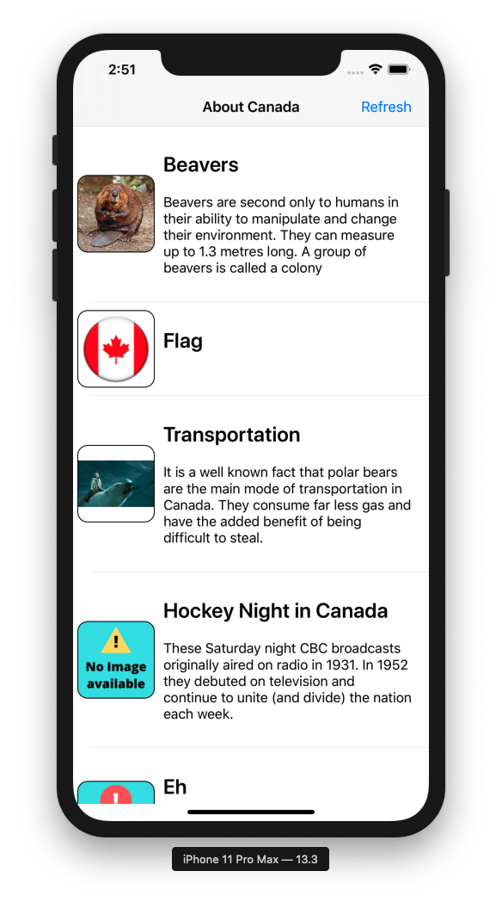
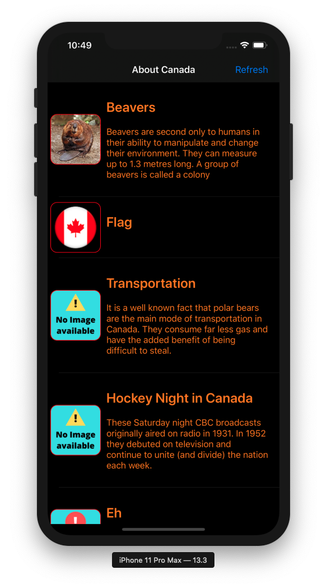

# About Canada Coding Test




[](https://travis-ci.org/joemccann/dillinger)

The purpose of this exercise is to assess candidate developer’s iOS coding knowledge and style. The exercise involves build a “proof of concept” app which consumes a REST service and displays photos with headings and descriptions. The exercise will be evaluated on coding style, understanding of programming concepts, choice of techniques, and also by the developer’s process, as indicated by the trail of git commits.

# Features!
1) It is a universal app supporting iOS version from 12.0 onwards using Swift 5 programming language.
2) App has been build by using the Xcode 11.3
3) The app is supporting both Landscape and portrait mode.
3) It not using any third party library and all the code has been written by me. 
4) It is using dynamic UITableView and UITableViewCell based on the data.
5) The UITableView cell has title, description and image.
6) The app is using UIRefreshControl and refresh button for the retry option.
7) The app is using UIAlertViewController to display service errors.
8) The navigation bar is displaying title which is coming from service.
9) Cell row is displaying full content based on the content coming from service.
10) Images are downloaded from the server when needed and once it downloaded it will always load from the in-memory cache
11) Service call does not block UI when loading the data from the JSON feed and it shows the loading indicator.
12) The app is not using any XIB, Storyboard (UITableView and UITableViewCell is created programmatically)
13) Table view scrolling is smooth and Image downloading does not stop UI thread.
14) Using programmatically auto layout constraints for UITableView and UITableViewCell.
15) For API call it is using NSURLSession and native handlers.

# Design Pattern
- It is using MVVM design pattarn.

# Service Calling
```swift
Networking.fetchFactsAboutCanada { [weak self] result in
            guard let self = self else { return }
            switch result {
            case .success(let factsData):
                // Should have factsData
            case .failure(let error):
               // Should have an error
            }
        }
```
